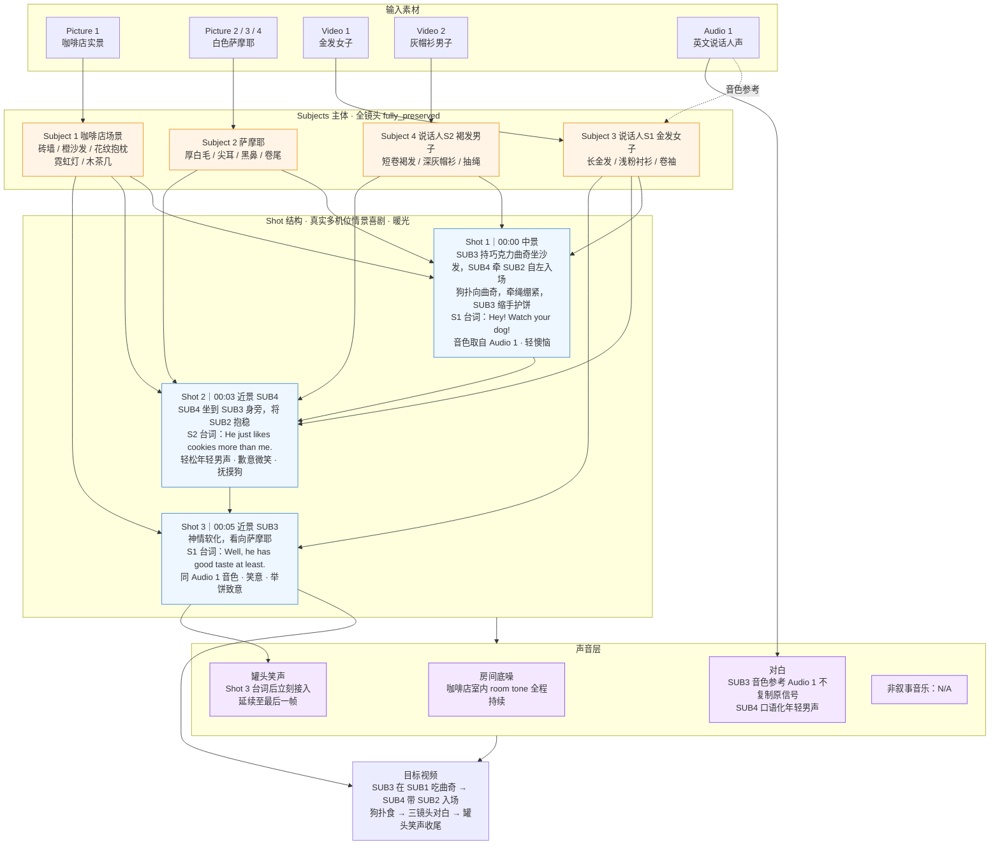
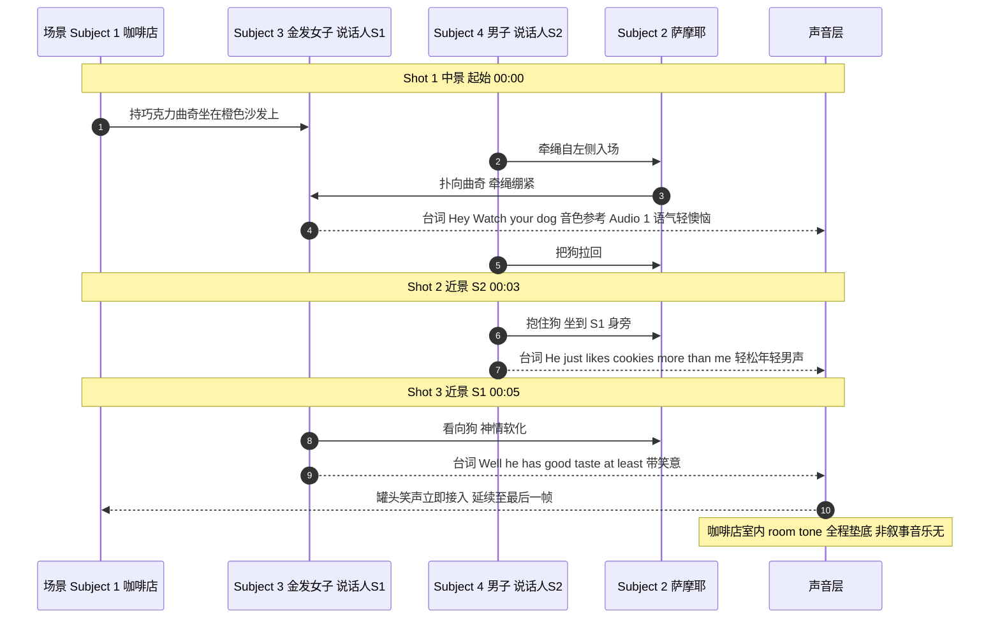

# Ref2VA 全参考提示词示例结构图：咖啡店 · 萨摩耶 · 双角色对白

> 学习产出：基于[全参考模式（Full-Reference）改写输出格式指南](../video-prompt-writing-guide-ref.md)整理的示例。
> 场景：咖啡店情景喜剧，萨摩耶扑曲奇，双角色三镜头对白，罐头笑声收尾（约 6 秒）。

## 输入素材

| 素材 | 内容 | 用途 |
|---|---|---|
| Picture 1 | 咖啡店实景 | 场景主体 Subject 1 |
| Picture 2 / 3 / 4 | 白色萨摩耶（多角度） | 角色主体 Subject 2 |
| Video 1 | 金发女子 | 说话人 S1 · Subject 3 |
| Video 2 | 灰帽衫男子 | 说话人 S2 · Subject 4 |
| Audio 1 | 英文说话人声 | S1 音色参考（不复制原信号） |

## 结构图 1：整体结构（素材 → 主体 → 镜头 → 声音）

## 结构图 2：时间线（镜头推进 + 声音事件）

## 与六段式输出的对应

| 六段式小节 | 对应结构图 1 部分 |
|---|---|
| `subject_definitions` | Subjects 层（SUB1–SUB4，含素材来源） |
| `summary` | 顶层箭头流：输入素材 → 目标视频 |
| `retention_analysis` | 各主体的 fully_preserved 标注 |
| `detailed_description` | Shot 层（SH1 → SH2 → SH3 时间推进） |
| `overall_soundscape` | 声音层（ROOM / VOX / LAF） |
| `non_diegetic_music` | MUS（N/A） |
