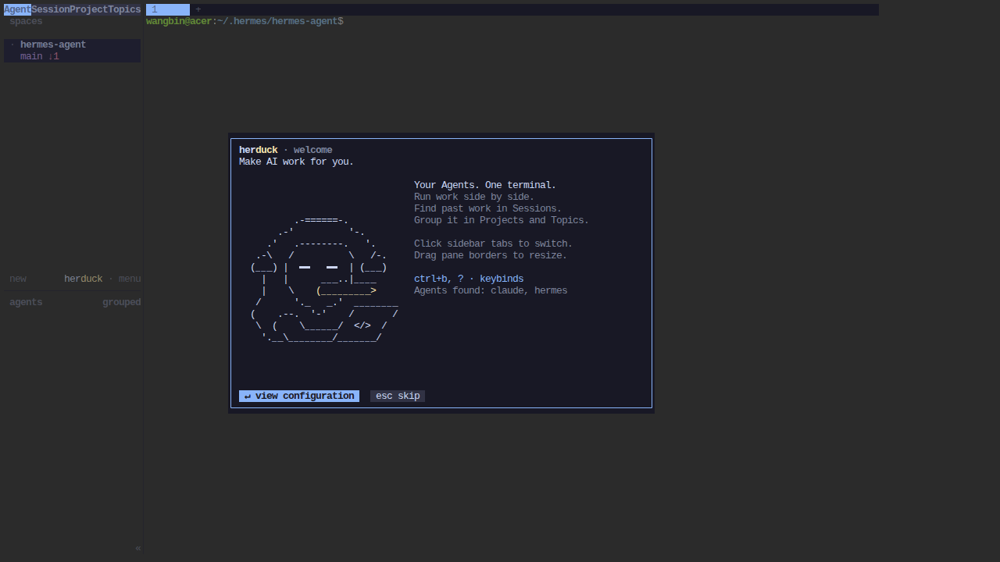
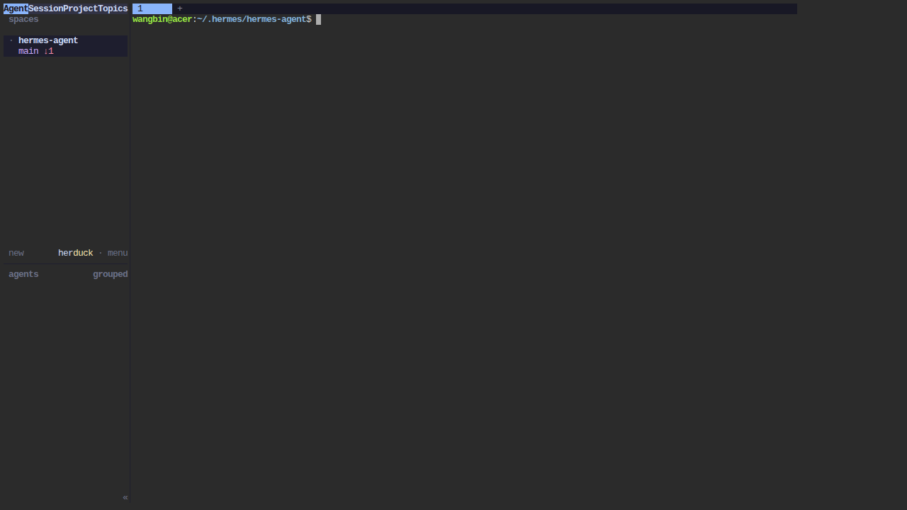
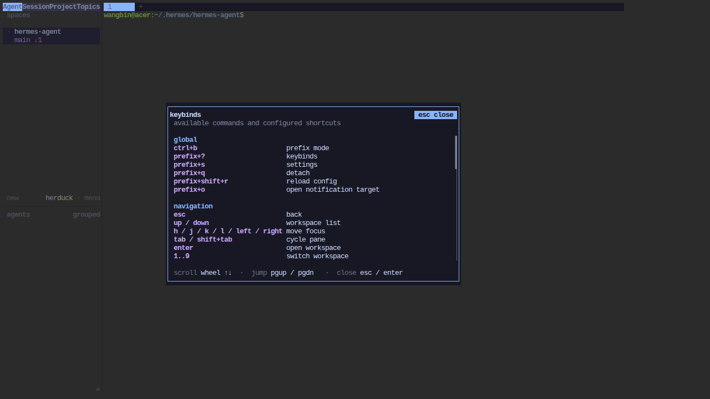
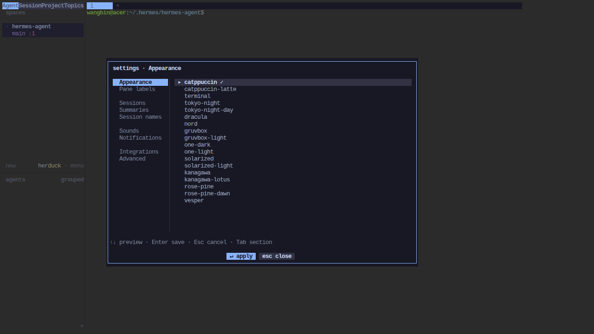
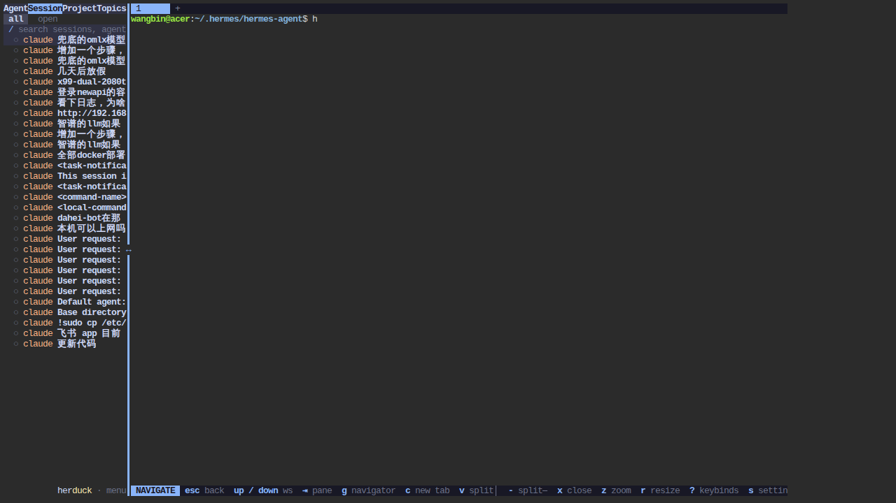
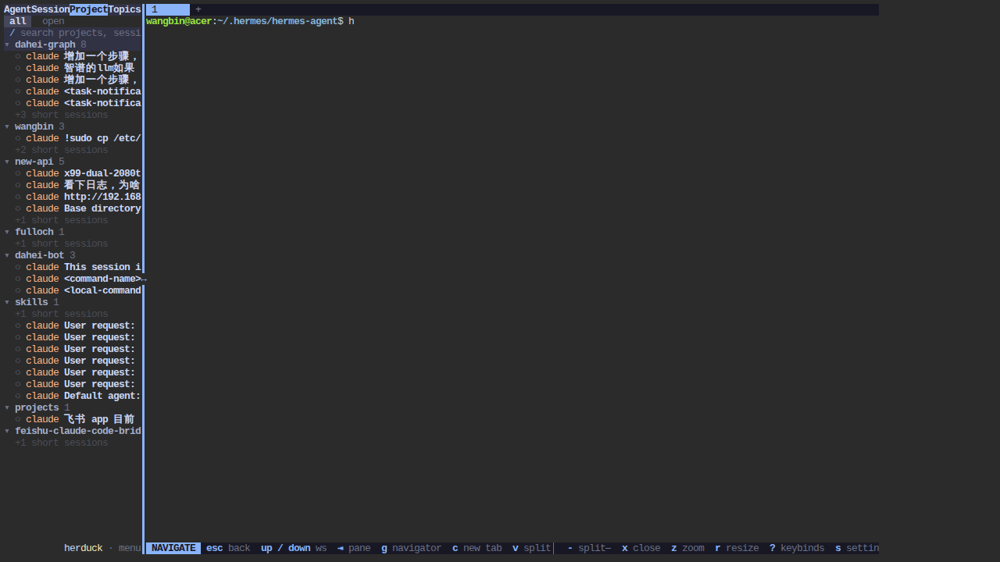
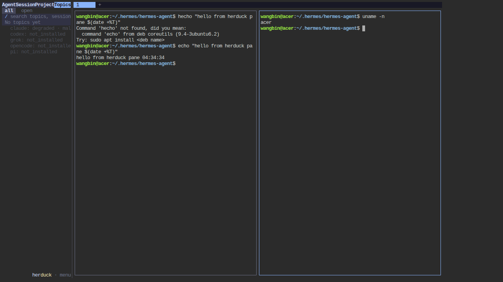

# Herduck 试用报告

> **对象**: [wenhanweime/herduck](https://github.com/wenhanweime/herduck) v0.1.0-alpha.2 — "The persistent work layer for Agents"
> **环境**: Ubuntu (acer / i5-8250U), glibc 2.39，官方预编译二进制
> **访问**: http://192.168.2.122:7681 （ttyd Web 终端网关，LAN 内可开）
> **日期**: 2026-09-29

---

## 一句话结论

Herduck 是一个 **tmux + Agent 会话库的混合体**：ratatui 全屏 TUI，把多个 Agent CLI（Claude Code / Codex / Grok / OpenCode / pi）跑在可分屏的 pane 里，底层用一个**独立存活的 server 进程**持有所有 PTY 和状态 —— 客户端随便断，工作不丢。Alpha 阶段完成度高于预期，但"Work 持久层"的核心卖点（Goal/Next steps/Blocker）本次未能完整验证。

---

## 1. 部署方式（非源码编译）

| 项 | 说明 |
|---|---|
| 克隆 | `git clone --depth 1`（直连 TLS 被断，走 127.0.0.1:7890 代理） |
| 构建 | **未从源码编译**。源码构建需 Rust 1.96.1 + Zig 工具链，i5-8250U 上代价过高；本机 glibc 2.39 恰好满足官方预编译要求（Ubuntu 24.04 / glibc ≥ 2.39），直接取 release 二进制，SHA256 校验通过 |
| LAN 暴露 | herduck 是**纯 TUI，原生无 HTTP 端口**——headless server 只监听 Unix socket。用 ttyd 1.7.7 做终端网关：`ttyd -W -i 0.0.0.0 -p 7681 herduck` |
| 踩坑 | ttyd 1.7.7 的 `-b` 是 `--base-path`（反代前缀）不是 bind，误用导致全站 404；绑定网卡要用 `-i` |

## 2. 首次启动与 Agent 发现

欢迎页：鸭子 ASCII art + "Make AI work for you"。自动扫描 PATH 上的 Agent CLI，本机识别出 **claude 和 hermes** 两个，其余（codex/grok/opencode/pi）标记 not_installed。底部 `view configuration` / `esc skip` 两个入口。

主界面：左侧栏（Agents/Sessions/Projects/Topics 四个 tab + workspace 列表）+ 右侧 pane 区。侧栏底部有**各 Agent 健康状态实时面板**（claude: degraded，其余 not_installed）——这个状态机是它做"继续打断的 Agent 工作"的基础。

## 3. 快捷键体系（tmux 血统）

`ctrl+b` 前缀键 + `?` 呼出帮助面板。从源码 `src/config/model.rs` 提取的完整默认键位：

| 类别 | 键位 |
|---|---|
| Pane | `prefix+v` 垂直分屏 / `prefix+-` 水平分屏 / `prefix+z` zoom / `prefix+x` 关闭 / `h j k l` 移焦点 / `tab` 循环切换 |
| Tab/Workspace | `prefix+c` 新 tab / `prefix+1..9` 切换 / `prefix+w` workspace picker / `prefix+g` goto |
| 模式 | `prefix+[` copy mode / `prefix+e` 编辑回滚缓冲 / `prefix+q` detach |
| 系统 | `prefix+s` 设置 / `prefix+shift+r` 热重载配置 / `prefix+b` 收起侧栏 |

设置页：**17 个内置主题**（catppuccin 全家桶、tokyo-night、dracula、nord、gruvbox、one-dark、solarized、kanagawa、rose-pine、vesper），六个设置分类（Appearance / Pane labels / Sessions 摘要与命名 / Sounds / Notifications / Integrations / Advanced），改完即时预览。

## 4. 会话库：把散落的历史收拢（核心卖点之一）

**Sessions 视图**自动索引了本机全部 Claude Code 历史会话，按标题列出（"兜底的omlx模型"、"登录newapi的容器"、"看下日志"……）。这是 README 说的"你不用再翻聊天记录拼上下文"的入口。

**Projects 视图**按工作目录自动分组：本机的 `dahei-graph (8)`、`wangbin (3)`、`new-api (5)`，短会话折叠为 `+3 short sessions`。目录即项目，零配置。

**Topics 视图**：空态（"No topics yet"）。Topics 是跨项目语义聚类，需要使用积累后自动生成，首日为空属正常。

## 5. Pane 操作

`prefix+v` 分屏：左右两个独立 shell，各自执行了 `echo` 和 `uname -n`，互不干扰；侧栏同时保持 agent 健康面板。

## 6. 持久层验证（本次试用最硬核的一条）

**操作**：浏览器整页刷新（等价杀掉 herduck 客户端进程）。

**结果**：双 pane 布局、左 pane 的完整命令历史、右 pane 的 `uname -n` 输出，**全部原样恢复**。

**源码印证**（`src/server/headless.rs`）：server 渲染到内存中的 ratatui 虚拟 buffer，持有全部 PTY；客户端经 `herduck.sock`（JSON API）+ `herduck-client.sock`（二进制帧协议）接驳，断开后 server 继续跑，重连即恢复。这就是"Agents execute, Herduck keeps the Work continuous"的工程实现。测试目录里 `detach_reattach.rs` / `live_handoff.rs` / `multi_client.rs` 表明连 server 换代时 PTY 都能导出迁移。

## 7. 未完成验证的部分

- **Work 计划（Goal / Next steps / Blocker）**：README 的核心差异点——可编辑的工作计划存活于会话之外，"Choose Continue with this" 把后续步骤派回原 Agent。本次点击历史会话行未见预览浮层，键盘路径仅出现 `read-only history` 提示，被叫停未深挖。
- **Continue with agent 实操**：本机 claude 状态为 degraded，未冒险在演示里拉起交互式 Agent。
- **通知/声音/Integrations**：未测。

## 8. 问题与局限

1. **侧栏 tab 只能鼠标切**：键盘方向键只在 Sessions/Projects/Work 视图内部循环（源码 `input/mod.rs`：Agents 视图按左右键是 no-op），与"Click sidebar tabs to switch"的鼠标优先设计一致，但键盘流用户会卡在 Agents 页。
2. **Web 终端下首键易丢**：点击 pane 后立刻打字，首字符偶发被吞（`echo` → `hecho`），xterm.js 焦点时序问题，非 herduck bug，但影响 Web 体验。
3. **release 与 HEAD 漂移**：release 二进制第四个 tab 渲染为 "Topics"，仓库 HEAD 源码已改名 "Work"，issue 反馈时注意版本。
4. **无鉴权部署**：ttyd 网关未加 basic auth，LAN 内裸奔（当前 192.168.2.122:7681），公网不可这么挂。
5. Linux 预编译仅 glibc ≥ 2.39，老发行版只能源码构建（Rust+Zig 双工具链门槛不低）。

## 9. 总评

| 维度 | 评价 |
|---|---|
| 定位 | Agent 时代的 tmux + 会话记忆层，切口独特 ✅ |
| 持久化架构 | server/client 分离 + PTY 所有权在 server，实测刷新无感恢复，是真功夫 ✅ |
| 会话/项目索引 | 零配置自动归集，开箱即用 ✅ |
| Work 计划层 | 概念最前瞻，本次未验证 ⚠️ |
| 成熟度 | alpha.2，交互细节（键盘可达性、焦点管理）还糙 🔶 |

**适合**：多 Agent 重度用户、长任务跨天续作场景。
**观望**：单 Agent 轻度用户暂时用 tmux + Claude Code 原生会话足够。

---
*报告与全部截图: `~/herduck-review/` · 部署进程: ttyd pid 2011217 (session proc_5d9c6eefefc3)*
